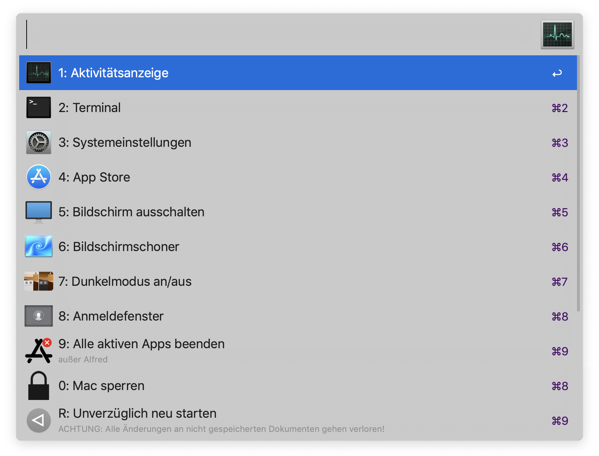

[Deutsche Beschreibung weiter unten](#system-tools-de-for-alfred-3)

# System Tools (EN) for Alfred 3

This simple Alfred workflow give you windows like access to common system commands and tools by just pressing a hotkey similar to Ctrl+Alt+Del:

- Open Activity Monitor
- Open Terminal
- Open System Preferences
- Open App Store
- Display sleep
- Launch Screensaver
- Toggle Dark mode on/off
- Switch to Login window
- Quit all running Apps
- Lock your Mac
- Force Reboot without saving documents

## Installation

[Download the Englisch worklfow](https://github.com/Tekl/alfred-system-tools/raw/master/System%20Tools%20%28EN%29.alfredworkflow) and install it by double click. Alfred will open and you can enter your preferred Hotkeys to call System Tools, for example Ctrl+Cmd+Del.

---

# System Tools (DE) for Alfred 3

Dieser einfache Alfred-Workflow zeigt wie Windows auf Tastendruck (à la Strg+Alt+Entf) ein Fenster mit wichtigen Systembefehlen und -Tools:

- Aktivitätsanzeige öffnen
- Terminal öffnen
- Systemeinstellungen öffnen
- App Store öffnen
- Bildschirm ausschalten
- Bildschirmschoner starten
- Dunkelmodus ein-/ausschalten
- Anmeldefenster zeigen
- Alle aktiven Apps beenden
- Mac sperren
- Unverzüglich neu starten ohne Dokumente zu sichern

## Installation

[Lade den deutschen Worklfow herunter](https://github.com/Tekl/alfred-system-tools/raw/master/System%20Tools%20%28DE%29.alfredworkflow) und installiere ihn via Doppelklick. Alfred wird gestartet und du kannst deine gewünschten Tastaturkürzel vergeben, zum Beispiel Ctrl+Cmd+Entf.

------

# Screenshot

